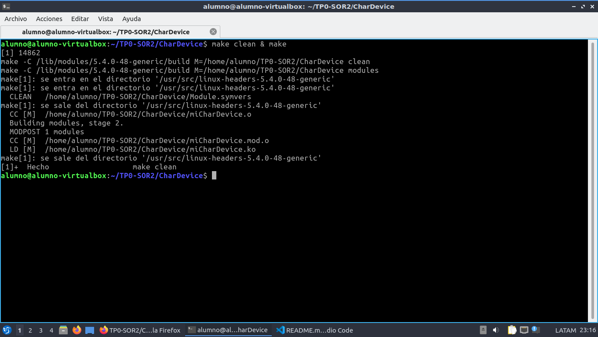

# TP0 - SOR2

## Introducción
En este trabajo se creo un modulo de kernel para un char device que haga encriptación cesar de 3.

## Pasos
* Ejecutar ```make clean & make``` para compilar el modulo


* Insertar el modulo con ```sudo insmod miCharDevice.ko``` y ver el log de kernel con el comando ```dmesg``` para ver que el modulo se inserto correctamente. También se puede ver que major number se le asigno y como crear el archivo para comunicarse con el driver.


* Creamos el archivo como se explico en el log utilizando ```sudo mknod``` y le habilitamos todos los permisos con ```chmod 777``` para no tener problemas de escritura.


* Hacemos un ```echo``` al char device en ```/dev/miCharDevice``` para pasarle la cadena de texto a encriptar. Y luego hacemos un ```cat``` sobre el char device para ver el resultado.


* Eliminamos el modulo con ```sudo rmmod miChardDevice.ko```


* Finalmente podemos ver como se elimino el modulo viendo el log de nuevo con ```dmesg```

