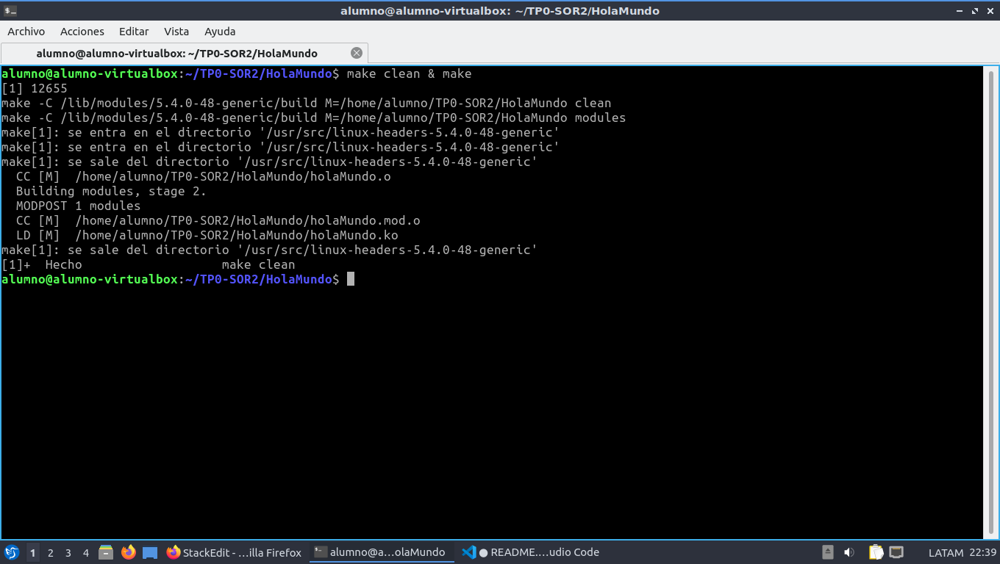
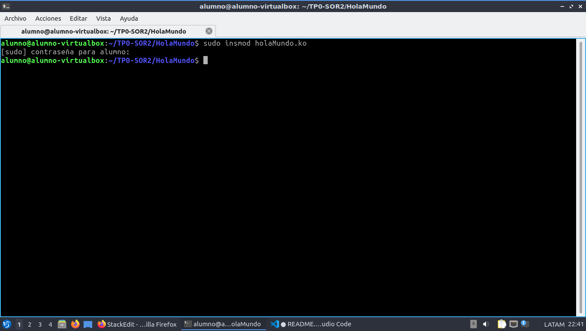
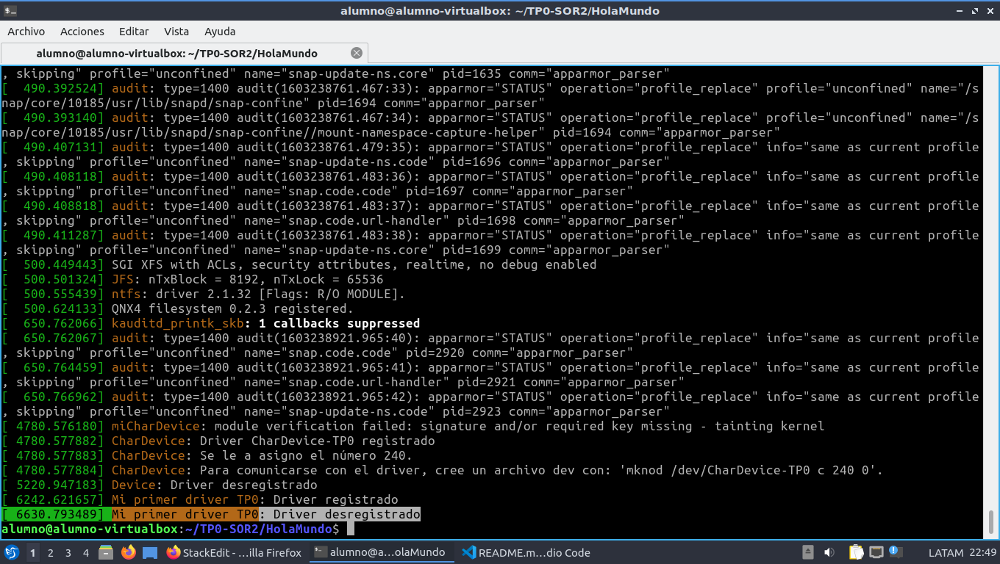

# TP0 - SOR2

## Introducción
En este trabajo se crea un modulo básico de ejemplo.

## Pasos 
* Ejecutar ```make clean & make``` para compilar el modulo


* Insertar el modulo con ```sudo insmod holaMundo.ko```


* Ver el log de kernel con el comando ```dmesg``` para ver que el modulo se inserto correctamente.


* Eliminar el modulo con ```sudo rmmod holaMundo.ko```


* Ver el log de kernel con el comando ```dmesg``` para ver que el modulo se elimino correctamente.

